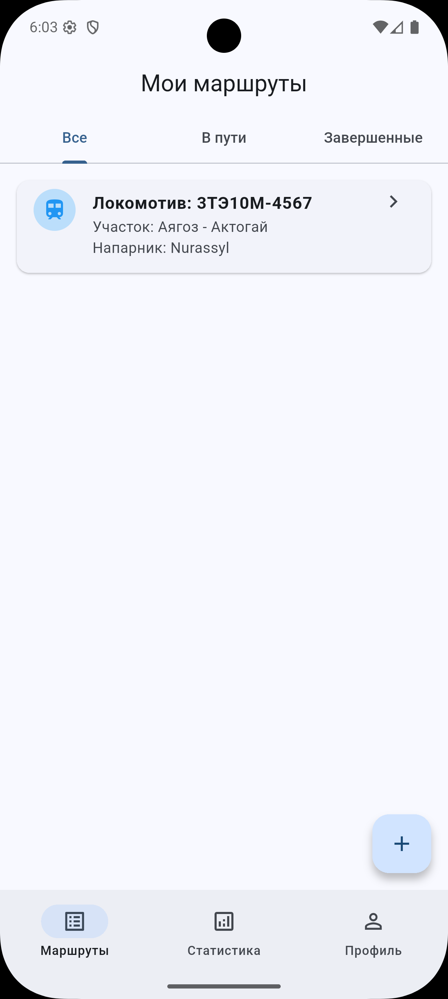
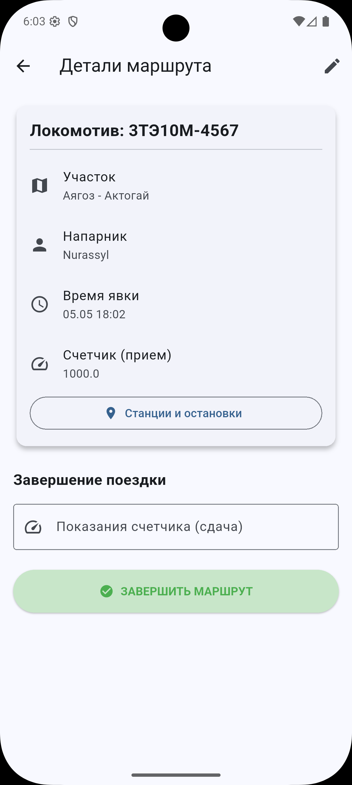
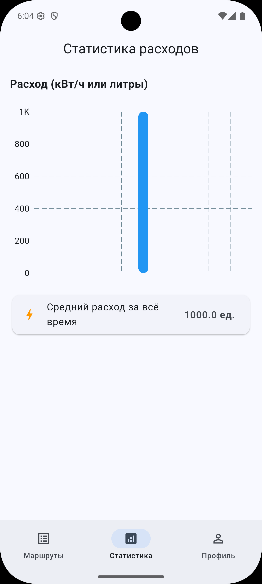
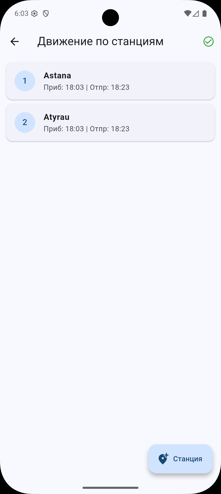
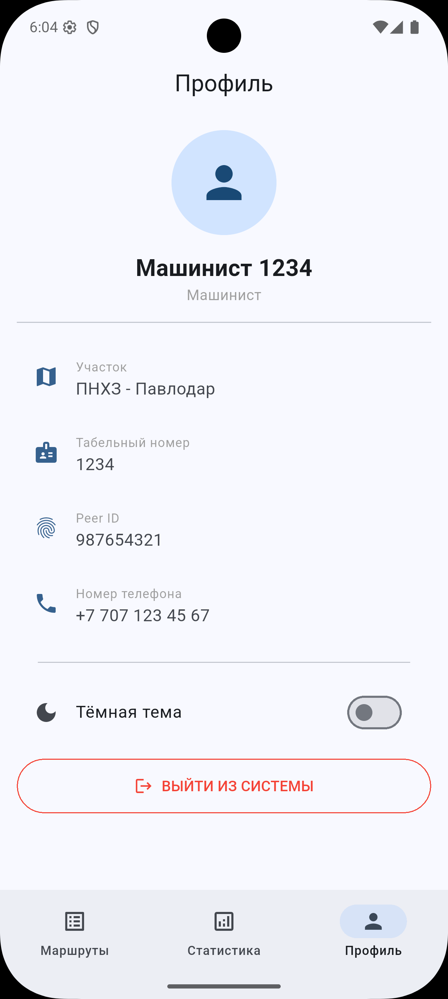

# Mastermind — Рабочее место машиниста локомотива 🚂

Финальный проект для DataGroup Academy. Мобильное приложение для учета рабочего времени, маршрутов и расхода электроэнергии/топлива локомотивных бригад.

## 📱 Скриншоты

  
  
  
  
  

## 🚀 Реализованный функционал (MVP + Бонусы)
- **Авторизация**: Вход по табельному номеру и паролю, сохранение сессии.
- **Офлайн-режим (Drift/SQLite)**: Приложение полностью автономно, данные не теряются без интернета.
- **CRUD операции**: Создание маршрутов, добавление станций, просмотр деталей, завершение (редактирование) и удаление свайпом.
- **Фильтрация**: Сортировка списков маршрутов по вкладкам (Все / В пути / Завершенные).
- **Аналитика**: Графики расхода и средних показателей (fl_chart).
- **Тёмная тема (+0.5 балла)**: Переключатель в профиле с сохранением состояния.

## 🛠 Технический стек и Архитектура
Проект построен по принципам **Strict Clean Architecture**:
- **UI / Навигация**: Flutter (Material 3), `go_router`.
- **State Management**: BLoC (Business Logic Component).
- **Архитектура**: Разделение на слои `presentation`, `domain` (Use Cases) и `data` (Repositories). Логика полностью отделена от UI.
- **Локальная БД**: `drift` (SQLite).
- **Графики**: `fl_chart`.

## ⚙️ Инструкция по запуску
1. Склонируйте репозиторий: `git clone https://github.com/ВАШ_ЛОГИН/mastermind.git`
2. Перейдите в папку проекта: `cd mastermind`
3. Установите зависимости: `flutter pub get`
4. Сгенерируйте файлы (если требуется для BLoC/Drift): `flutter pub run build_runner build --delete-conflicting-outputs`
5. Запустите проект: `flutter run`